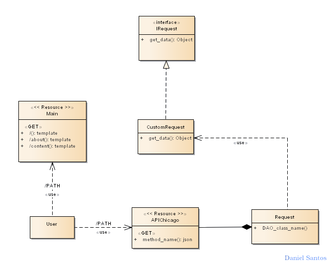

<h1>CHICAGO POINT<h1>
<h6>find a house in Chicago<h6>

   
    
       

    <a href="http://www.youtube.com/watch?feature=player_embedded&v=q1zJT8Zg_mk" target="_blank">See the live project</a>  

    <a href="http://www.youtube.com/watch?feature=player_embedded&v=q1zJT8Zg_mk" target="_blank">See a video that shows the functionalities </a>

    <iframe
   class=""
  src="https://www.youtube.com/embed/hgzzLIa-93c?autoplay=0& modestbranding=1&rel=0"
  frameborder="0"
  allowTransparency="false"
  allowfullscreen
  >

Model
============

    

Datasets
========

* [Weather Dataset]( https://www.ncdc.noaa.gov/cdo-web/api/v2/datasets)
* [Rent Dataset](https://data.cityofchicago.org/resource/uahe-iimk.json)
* [Information healthy comunity.](https://data.cityofchicago.org/resource/iqnk-2tcu.json)
* [Police Stations](https://data.cityofchicago.org/resource/gkur-vufi.json)
* [Parks](https://data.cityofchicago.org/resource/4xwe-2j3y.json)
* [Hospitals](https://data.cityofchicago.org/resource/cjg8-dbka.json)
* [Cost Rent Chicago](https://www.zumper.com/blog/2015/03/chicago-rent-prices-by-neighborhood-february-2015/)
* [Libraries](https://data.cityofchicago.org/resource/x8fc-8rcq.json)

Author
=====

* Name : Daniel Santos
* Email : dfsantosbu@unal.edu.co

License
=======

GPL V3
**Free Software, It's the right way  to do things!**
